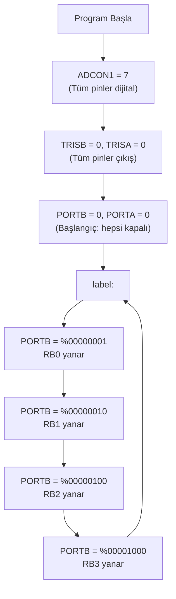

# 📘 PIC Mikrodenetleyici Temelleri — Konu Anlatımı

> **Kaynak Dosya:** [.TAMADIMpbp.pbp](file:///c:/Users/Aleyna/Desktop/denetleyici/.TAMADIMpbp.pbp)
> **Konu:** PIC'e giriş, port yapılandırma, temel PicBasic Pro (PBP) söz dizimi

---

## 📌 1. Bu Kod Ne Yapıyor? (Genel Bakış)

Bu program, bir PIC mikrodenetleyicinin **PORTB** pinlerini sırayla yakarak (1 yaparak) basit bir **LED kaydırma (shift)** işlemi gerçekleştirir. Yani 4 LED'i sırayla yakar ve bu işlemi sonsuz döngüde tekrarlar.

```
LED1 → LED2 → LED3 → LED4 → LED1 → LED2 → ... (sonsuz döngü)
```

---

## 📌 2. Kodun Satır Satır Açıklaması

### 🔹 Başlık Bloğu (Satır 1-10)
```basic
'****************************************************************
'*  Name    : UNTITLED.BAS                                      *
'*  Author  : [select VIEW...EDITOR OPTIONS]                    *
'*  Date    : 14.04.2026                                        *
'*  Version : 1.0                                               *
'****************************************************************
```
- PicBasic Pro'da **tek tırnak (`'`)** ile başlayan satırlar **yorum satırlarıdır**.
- Derleyici bu satırları **tamamen görmezden gelir**.
- Programın ne yaptığını, kimin yazdığını, tarihini not almak için kullanılır.

> [!TIP]
> Sınavda yorum satırı sorulursa: PBP'de `'` (tek tırnak) ile başlar. C dilinde `//` veya `/* */` kullanılır. Karıştırmayın!

---

### 🔹 `DEFINE LOADER_USED 1` (Satır 11)
```basic
DEFINE LOADER_USED 1
```
- Bu satır **bootloader** kullanıldığını belirtir.
- Bootloader, programı PIC'e yüklemek için kullanılan bir yazılımdır.
- Bu tanım yapılmazsa, program belleğin yanlış adresinden başlayabilir.

> [!NOTE]
> Bu satır pratikte her programın başına yazılır. Sınavda "Bu satır ne işe yarar?" diye sorulabilir. Cevap: **Bootloader kullanıldığında programın doğru bellek adresinden başlamasını sağlar.**

---

### 🔹 `ADCON1 = 7` (Satır 12)

```basic
ADCON1 = 7
```

Bu satır **çok önemli** ve sınavda sıkça sorulan bir konudur!

**ADCON1** (Analog-to-Digital Control Register 1), PIC'in pinlerinin **analog mı yoksa dijital mi** çalışacağını belirler.

| ADCON1 Değeri | Anlam |
|:---:|:---|
| `0` | Tüm pinler **analog** (ADC girişi olarak çalışır) |
| `7` | Tüm pinler **dijital** (normal I/O olarak çalışır) |
| `6` | Bazı pinler analog, bazıları dijital |

> [!IMPORTANT]
> **ADCON1 = 7** demek: "Bu PIC'in tüm pinlerini dijital olarak kullanacağım" demektir. Eğer bu satırı yazmazsanız, bazı pinler varsayılan olarak analog kalır ve LED yakmak gibi dijital işlemler **çalışmaz**!

> [!CAUTION]
> Sınavda en sık yapılan hata: ADCON1 yazmayı unutmak. Eğer bir soru "LED yanmıyor, neden?" derse, ilk kontrol etmeniz gereken şey **ADCON1 ayarıdır**.

---

### 🔹 `TRISB = 0` ve `TRISA = 0` (Satır 13-14)

```basic
TRISB = 0
TRISA = 0
```

**TRIS** (Tri-State) registerları, pinlerin **giriş mi çıkış mı** olacağını belirler.

| TRIS Değeri | Bit Değeri | Pin Yönü |
|:---:|:---:|:---|
| `0` | `0` | **Çıkış (Output)** — LED sürmek, motor sürmek vb. |
| `1` | `1` | **Giriş (Input)** — Buton okumak, sensör okumak vb. |

**Ezber Kolaylığı:**
- **0 = O = Output (Çıkış)** 🔴
- **1 = I = Input (Giriş)** 🟢

`TRISB = 0` demek: **PORTB'nin 8 pininin tamamı çıkış olarak ayarlandı.**

Eğer sadece bazı pinleri giriş/çıkış yapmak isterseniz:
```basic
TRISB = %00001111   ' Üst 4 pin çıkış, alt 4 pin giriş
```

> [!IMPORTANT]
> **TRIS registerları pin yönünü belirler.** Her port için ayrı bir TRIS registerı vardır:
> - `TRISA` → PORTA pinleri için
> - `TRISB` → PORTB pinleri için
> - `TRISC` → PORTC pinleri için (varsa)

---

### 🔹 `PORTB = 0` ve `PORTA = 0` (Satır 15-16)

```basic
PORTB = 0
PORTA = 0
```

Bu satırlar portların **başlangıç değerini sıfırlar**. Yani tüm pinler **LOW (0V)** ile başlar. Hiçbir LED yanmaz, hiçbir çıkış aktif değildir.

> [!TIP]
> İyi bir programlama alışkanlığı olarak, program başında portları sıfırlamak gerekir. Aksi takdirde pinler rastgele bir değerle başlayabilir.

---

### 🔹 Değişken Tanımlama (Satır 17-18)

```basic
i var byte
j var byte
```

PicBasic Pro'da değişken tanımlama söz dizimi:

```
değişken_adı VAR tip
```

| Tip | Boyut | Değer Aralığı |
|:---|:---:|:---|
| `BIT` | 1 bit | 0 veya 1 |
| `BYTE` | 8 bit (1 bayt) | 0 — 255 |
| `WORD` | 16 bit (2 bayt) | 0 — 65535 |

Bu kodda `i` ve `j` adında iki adet **byte** tipinde değişken tanımlanmış. (Bu kodda kullanılmıyor olsalar da, tanımlama örneği olarak önemli.)

> [!NOTE]
> Sınavda değişken tipleri sorulabilir. **byte = 8 bit = 0-255** arası değer alır. **word = 16 bit = 0-65535** arası değer alır.

---

### 🔹 Etiket ve Sonsuz Döngü (Satır 20, 26)

```basic
label:
    ' ... kodlar ...
goto label
```

- `label:` bir **etiket (label)** tanımıdır. İsmi serbesttir (baslangic, dongu, ana vb. olabilir).
- `goto label` komutu, programı **label** etiketine geri gönderir.
- Bu yapı bir **sonsuz döngü** oluşturur.

> [!IMPORTANT]
> PIC mikrodenetleyicilerde program **asla bitmemelidir**. Çünkü PIC sürekli çalışan bir cihazdır. Bu yüzden her programda mutlaka bir sonsuz döngü bulunur. `goto` + etiket yapısı bunun en temel yoludur.

---

### 🔹 Port Çıkışları — Binary (İkili) Gösterim (Satır 21-24)

```basic
portB = %00000001    ' RB0 pini HIGH (1. LED yanar)
portB = %00000010    ' RB1 pini HIGH (2. LED yanar)
portB = %00000100    ' RB2 pini HIGH (3. LED yanar)
portB = %00001000    ' RB3 pini HIGH (4. LED yanar)
```

`%` işareti **binary (ikili sayı sistemi)** gösterimini belirtir.

**PORTB 8 bitlik bir registerdır:**

```
Bit:    7    6    5    4    3    2    1    0
Pin:   RB7  RB6  RB5  RB4  RB3  RB2  RB1  RB0
```

| Kod | Binary | Aktif Pin | Decimal |
|:---|:---:|:---:|:---:|
| `%00000001` | 00000001 | RB0 | 1 |
| `%00000010` | 00000010 | RB1 | 2 |
| `%00000100` | 00000100 | RB2 | 4 |
| `%00001000` | 00001000 | RB3 | 8 |

> [!TIP]
> **Binary → Decimal dönüşüm**: Sağdan sola 2'nin kuvvetleri:
> ```
> Bit 0 = 2⁰ = 1
> Bit 1 = 2¹ = 2
> Bit 2 = 2² = 4
> Bit 3 = 2³ = 8
> Bit 4 = 2⁴ = 16
> Bit 5 = 2⁵ = 32
> Bit 6 = 2⁶ = 64
> Bit 7 = 2⁷ = 128
> ```

---

## 📌 3. Programın Akış Diyagramı



---

## 📌 4. Kodda Eksik Olan Şey: PAUSE Komutu

> [!WARNING]
> Bu kodda LED'ler arası **bekleme (PAUSE)** komutu yok! Bu durumda LED'ler o kadar hızlı değişir ki, insan gözü farkı göremez. Tüm LED'ler aynı anda yanıyor gibi görünür.
>
> Doğru kod şöyle olmalıydı:
> ```basic
> label:
> portB = %00000001
> PAUSE 500          ' 500 ms bekle
> portB = %00000010
> PAUSE 500
> portB = %00000100
> PAUSE 500
> portB = %00001000
> PAUSE 500
> goto label
> ```
> `PAUSE 500` → 500 milisaniye (yarım saniye) bekle demektir.

---

## 📌 5. Sınav İçin Dikkat Edilmesi Gereken Konular

### ✅ Mutlaka Bilinmesi Gerekenler

| Konu | Özet |
|:---|:---|
| **ADCON1** | Pinlerin analog/dijital ayarı. `7` = tümü dijital |
| **TRIS** | Pin yönü. `0` = çıkış, `1` = giriş |
| **PORT** | Pinin değeri. `1` = HIGH (5V), `0` = LOW (0V) |
| **`%` gösterimi** | Binary sayı sistemi |
| **`$` gösterimi** | Hexadecimal sayı sistemi |
| **VAR** | Değişken tanımlama: `isim VAR byte` |
| **goto + label** | Sonsuz döngü oluşturma |
| **PAUSE** | Milisaniye cinsinden bekleme |
| **Yorum satırı** | `'` ile başlar |

### ⚠️ Sık Yapılan Hatalar

1. **ADCON1 yazmayı unutmak** → Analog pinler dijital çalışmaz
2. **TRIS yönünü ters yazmak** → `0 = çıkış`, `1 = giriş` (ters yazmayın!)
3. **PAUSE koymamak** → LED'ler çok hızlı değişir, görünmez
4. **Sonsuz döngü unutmak** → Program bir kez çalışır ve durur (PIC'te tehlikeli)
5. **Binary gösterimde bit sırasını karıştırmak** → En sağdaki bit = Bit 0 = RB0

### 🧠 Kavramsal Sorular İçin Hazırlık

- **"PIC mikrodenetleyici nedir?"** → Tek bir çip üzerinde işlemci, bellek ve I/O portları bulunan küçük bir bilgisayardır.
- **"Port nedir?"** → Dış dünya ile iletişim kurmak için kullanılan pin gruplarıdır (PORTA, PORTB, PORTC...).
- **"TRIS ne işe yarar?"** → Port pinlerinin giriş mi çıkış mı olacağını belirler.
- **"Neden sonsuz döngü gerekli?"** → PIC sürekli çalışan bir cihazdır. Program biterse PIC tanımsız duruma geçer.

---

## 📌 6. Sayı Sistemleri Hızlı Referans

PicBasic Pro'da sayı gösterimleri:

| Önek | Sayı Sistemi | Örnek | Decimal Karşılığı |
|:---:|:---|:---|:---:|
| *(yok)* | Decimal (10'luk) | `255` | 255 |
| `%` | Binary (2'lik) | `%11111111` | 255 |
| `$` | Hexadecimal (16'lık) | `$FF` | 255 |

---

> Bir sonraki dosyaya geçmeye hazır olduğunda söyle! Sırayla tüm konuları işleyeceğiz. 🚀
