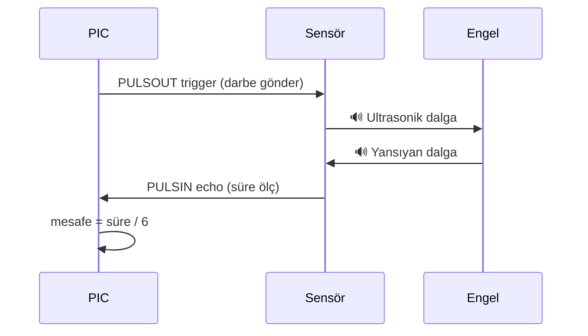

# 📘 Ultrasonik Sensör ile Boy Ölçme — Konu Anlatımı

> **Kaynak Dosya:** [BoyOlcme2.pbp](file:///c:/Users/Aleyna/Desktop/denetleyici/BoyOlcme2.pbp)
> **Konu:** HC-SR04 ultrasonik sensör ile mesafe ölçüp LCD'de boy hesaplama

---

## 📌 1. Bu Kod Ne Yapıyor?

1. İlk ölçüm: Sensörden **tavana olan mesafe** (X) ölçülür
2. İkinci ölçüm: Kişi sensörün önüne gelir → **kişinin başına olan mesafe** (Y) ölçülür
3. **Boy = X - Y** formülüyle boy hesaplanır ve LCD'ye yazdırılır

```
┌─────────────────── Tavan ───────────────────┐
│                                              │
│  ← X (ilk ölçüm: tavana uzaklık)            │
│                                              │
│  ┌───┐  ← Y (ikinci ölçüm: başa uzaklık)    │
│  │   │                                       │
│  │   │  ← Boy = X - Y                        │
│  └───┘                                       │
└─────────────────── Zemin ───────────────────┘
```

---

## 📌 2. Ultrasonik Sensör (HC-SR04) Nasıl Çalışır?

Ultrasonik sensör **ses dalgası** göndererek mesafe ölçer:

1. **Trigger** pinine kısa bir darbe gönderilir
2. Sensör **ultrasonik ses dalgası** yayar
3. Ses dalgası engele çarpıp **geri döner**
4. **Echo** pininden geri dönme süresi ölçülür
5. Süre → mesafe'ye dönüştürülür



---

## 📌 3. Pin Tanımları — SYMBOL Kullanımı

```basic
symbol trigger = portB.7    ' Ultrasonik sensörün tetikleme pini
symbol echo = portB.6       ' Ultrasonik sensörün yankı pini
```

- `SYMBOL` → Bir pine **isim vermek** için kullanılır (okunabilirliği artırır)
- `portB.7` → PORTB'nin 7. biti (tek bir pin)
- `portB.6` → PORTB'nin 6. biti

> [!TIP]
> `SYMBOL` ile `VAR` farklıdır:
> - `SYMBOL` → Bir **port pinine** isim verir
> - `VAR` → Bellekte yeni bir **değişken** oluşturur

---

## 📌 4. Sabit Tanımlama — CON

```basic
sonuc_cm CON 6    ' Sabit değer: dönüşüm katsayısı
```

- `CON` → **Sabit (constant)** tanımlar. Program boyunca değişmez.
- Sensörün salınım süresini cm'ye çevirmek için kullanılır.
- `VAR` → değişken (değişebilir), `CON` → sabit (değişemez)

---

## 📌 5. PULSOUT ve PULSIN Komutları

```basic
pulsout trigger, 1        ' Trigger pinine 10µs'lik darbe gönder
pulsin echo, 1, salinim   ' Echo pininden HIGH darbe süresini ölç
```

| Komut | Açıklama |
|:---|:---|
| `PULSOUT pin, süre` | Belirtilen pinden darbe **gönderir** (süre x 10µs) |
| `PULSIN pin, durum, değişken` | Belirtilen pindeki darbe **süresini ölçer** |

- `PULSIN echo, 1, salinim` → Echo pininde HIGH sinyalinin ne kadar sürdüğünü `salinim` değişkenine yazar
- `1` → HIGH (yüksek) darbe ölç, `0` → LOW (düşük) darbe ölç

---

## 📌 6. Mesafe Hesaplama

```basic
mesafe = (salinim / sonuc_cm)    ' sonuc_cm = 6
```

- `salinim` → PULSIN'den okunan ham değer (süre)
- `sonuc_cm = 6` → dönüşüm katsayısı
- Bölme yapılarak mesafe **cm** cinsinden bulunur

> [!NOTE]
> Ses hızı yaklaşık 343 m/s'dir. Sensör gidiş-dönüş süresini ölçtüğü için süre 2'ye bölünür. PIC'in saat frekansına göre katsayı değişir.

---

## 📌 7. LCD Tanımları

```basic
DEFINE LCD_DREG PORTD       ' LCD veri hattı: PORTD
DEFINE LCD_DBIT 0           ' Veri başlangıç bit: 0
DEFINE LCD_RSREG PORTE      ' RS pini portu: PORTE
DEFINE LCD_RSBIT 0          ' RS pini bit: 0
DEFINE LCD_EREG PORTE       ' Enable pini portu: PORTE
DEFINE LCD_EBIT 2           ' Enable pini bit: 2
DEFINE LCD_BITS 8           ' 8 bit mod
```

Bu tanımlar LCD ekranın **hangi portlara bağlı olduğunu** belirler.

| Tanım | Açıklama |
|:---|:---|
| `LCD_DREG` | Veri pinlerinin bağlı olduğu port |
| `LCD_DBIT` | Veri pinlerinin başlangıç biti |
| `LCD_RSREG` | RS (Register Select) pini portu |
| `LCD_EREG` | Enable pini portu |
| `LCD_BITS` | 4 bit mi 8 bit mi mod? |

---

## 📌 8. LCDOUT Komutları

```basic
lcdout $fe, 1                          ' Ekranı temizle
lcdout "X: ", #mesafe, " cm"           ' 1. satıra yaz
lcdout $fe, 192, "boy: ", #(mesafe-Y)  ' 2. satıra yaz
```

| Komut | Açıklama |
|:---|:---|
| `$FE, 1` | Ekranı temizle |
| `$FE, $80` | İmleci 1. satır başına getir |
| `$FE, $C0` veya `$FE, 192` | İmleci 2. satır başına getir |
| `#değişken` | Değişkenin **sayısal değerini** yazdır |
| `"metin"` | Sabit metin yazdır |

> [!IMPORTANT]
> `#` işareti olmadan `mesafe` yazarsanız, mesafenin ASCII karşılığı olan **karakter** yazdırılır, sayı değil! Sayı yazdırmak için **`#mesafe`** kullanın.

---

## 📌 9. WORD Değişken Tipi

```basic
salinim var word
mesafe var word
```

Mesafe değerleri 255'i geçebileceği için **WORD** (16 bit, 0-65535) kullanılmış.

| Tip | Bit | Aralık | Ne zaman kullan? |
|:---|:---:|:---|:---|
| `BIT` | 1 | 0-1 | Açık/kapalı durumlar |
| `BYTE` | 8 | 0-255 | Küçük sayılar |
| `WORD` | 16 | 0-65535 | Büyük sayılar (mesafe, sıcaklık vb.) |

---

## 📌 10. Sınav İçin Dikkat Noktaları

| Konu | Hatırla |
|:---|:---|
| **PULSOUT** | Darbe **gönder** (trigger) |
| **PULSIN** | Darbe süresi **ölç** (echo) |
| **SYMBOL** | Port pinine isim verir |
| **CON** | Sabit tanımlar (değişmez) |
| **WORD** | 16 bit, 0-65535 arası |
| **LCDOUT $FE,1** | Ekranı temizle |
| **LCDOUT $FE,$C0** | 2. satıra geç |
| **`#`** | Sayı olarak yazdır |
| **LCD tanımları** | DREG, DBIT, RSREG, EREG... |
