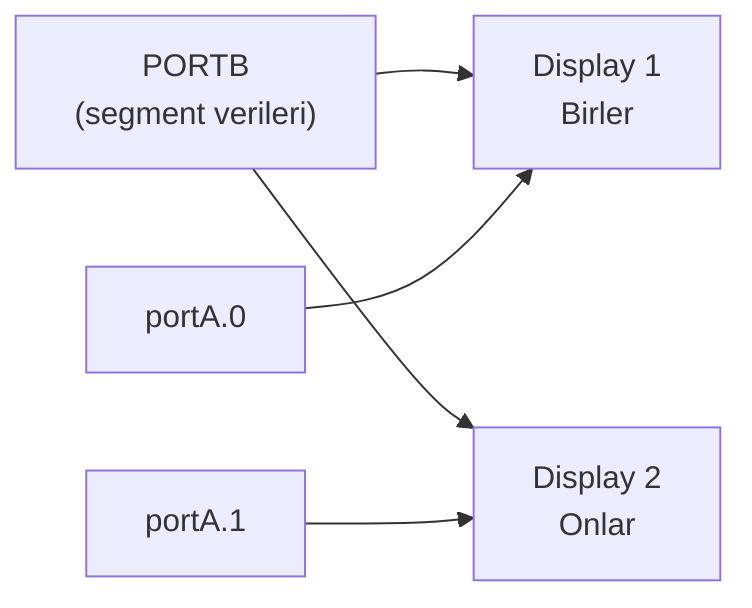

# 📘 7-Segment Display'de Sayı Yazdırma — Konu Anlatımı

> **Kaynak Dosya:** [Displayde_Sayi-yazdirma.pbp](file:///c:/Users/Aleyna/Desktop/denetleyici/Displayde_Sayi-yazdirma.pbp)
> **Konu:** 7-segment display kullanımı, dizi (array), DIG operatörü, multiplexing

---

## 📌 1. Bu Kod Ne Yapıyor?

Seri porttan girilen bir rakamı (veya 0-99 arası sayıyı) **7-segment display** üzerinde gösterir.

---

## 📌 2. 7-Segment Display Nedir?

7-segment display, **7 adet LED segmentinden** oluşan bir gösterge bileşenidir. Her segment bir harf ile adlandırılır:

```
  ─── a ───
 |         |
 f         b
 |         |
  ─── g ───
 |         |
 e         c
 |         |
  ─── d ───   . dp
```

Her segment bir bite karşılık gelir:

| Bit | 6 | 5 | 4 | 3 | 2 | 1 | 0 |
|:---:|:---:|:---:|:---:|:---:|:---:|:---:|:---:|
| Segment | **g** | **f** | **e** | **d** | **c** | **b** | **a** |

---

## 📌 3. Segment Kodları (Dizi Tanımı)

```basic
a var byte[10]       ' 10 elemanlı byte dizisi
a[0] = %00111111     ' 0 rakamı: a,b,c,d,e,f segmentleri yanık
a[1] = %00000110     ' 1 rakamı: b,c segmentleri yanık
a[2] = %01011011     ' 2 rakamı
a[3] = %01001111     ' 3 rakamı
a[4] = %01100110     ' 4 rakamı
a[5] = %01101101     ' 5 rakamı
a[6] = %01111101     ' 6 rakamı
a[7] = %00000111     ' 7 rakamı
a[8] = %01111111     ' 8 rakamı (hepsi yanık)
a[9] = %01101111     ' 9 rakamı
```

### Her Rakamın Segment Açıklaması

| Rakam | Binary | Aktif Segmentler | Görünüm |
|:---:|:---:|:---|:---:|
| 0 | `%00111111` | a,b,c,d,e,f | **0** |
| 1 | `%00000110` | b,c | **1** |
| 2 | `%01011011` | a,b,d,e,g | **2** |
| 3 | `%01001111` | a,b,c,d,g | **3** |
| 4 | `%01100110` | b,c,f,g | **4** |
| 5 | `%01101101` | a,c,d,f,g | **5** |
| 6 | `%01111101` | a,c,d,e,f,g | **6** |
| 7 | `%00000111` | a,b,c | **7** |
| 8 | `%01111111` | a,b,c,d,e,f,g | **8** |
| 9 | `%01101111` | a,b,c,d,f,g | **9** |

> [!IMPORTANT]
> Bu segment kodları **sınavda ezber** olarak sorulabilir! Özellikle 0 (%00111111) ve 8 (%01111111) hatırlanması kolay olanlardır.

---

## 📌 4. Dizi (Array) Tanımlama

```basic
a var byte[10]    ' 10 elemanlı byte dizisi (a[0] - a[9])
```

- PBP'de dizi tanımı: `isim VAR tip[boyut]`
- İndeks **0'dan** başlar
- `a[0]` → ilk eleman, `a[9]` → son eleman
- `portB = a[x]` → x değişkenine göre ilgili segment kodu PORTB'ye yazılır

---

## 📌 5. DIG Operatörü — Basamak Ayırma

```basic
birler = i DIG 0     ' i sayısının birler basamağı
onlar  = i DIG 1     ' i sayısının onlar basamağı
```

`DIG` operatörü bir sayının **belirli basamağını** alır:

| Değer | DIG 0 (birler) | DIG 1 (onlar) |
|:---:|:---:|:---:|
| 45 | 5 | 4 |
| 73 | 3 | 7 |
| 8 | 8 | 0 |
| 99 | 9 | 9 |

> [!TIP]
> `DIG 0` → birler, `DIG 1` → onlar, `DIG 2` → yüzler basamağını verir. Sınavda çok kullanışlı!

---

## 📌 6. Multiplexing (Çoğullama) Tekniği

İki basamaklı bir sayıyı **iki ayrı 7-segment display'de** göstermek için **multiplexing** kullanılır:

```basic
for j = 0 to 24
    portA.0 = 1 : portA.1 = 0    ' 1. display aktif
    portB = a[birler]              ' Birler basamağını göster
    pause 10

    portA.0 = 0 : portA.1 = 1    ' 2. display aktif
    portB = a[onlar]               ' Onlar basamağını göster
    pause 10
next j
```

### Nasıl Çalışır?

1. İlk display'i aktif et → birler basamağını göster → 10ms bekle
2. İkinci display'i aktif et → onlar basamağını göster → 10ms bekle
3. Bu işlemi çok hızlı tekrarla (25 kez)
4. İnsan gözü hızlı değişimi **fark edemez** → iki display de aynı anda yanıyor gibi görünür!

> [!IMPORTANT]
> **Multiplexing = Tek PORTB'yi iki display için paylaşma tekniği.** PortA pinleri hangi display'in aktif olduğunu belirler. Bu teknik PORTB'nin hem birler hem onlar display'ine ortak bağlı olması nedeniyle gereklidir.



---

## 📌 7. Seri Porttan Tek Rakam Okuma

```basic
label:
    hserout["rakam girin: ", 13, 10]
    hserin [x]
    hserout["girilen sayi: "]
    hserout[dec (x-48), 13, 10]
    portB = a[x-48]
goto label
```

- `hserin [x]` → Bilgisayardan bir karakter al
- Karakterin **ASCII değeri** gelir (örn: `'5'` = ASCII 53)
- `x - 48` → ASCII'yi rakama çevir (53 - 48 = 5)
- `a[5]` → 5 rakamının segment kodu

> [!NOTE]
> ASCII tablosunda `'0'` = 48, `'1'` = 49, ... `'9'` = 57. Bu yüzden `x - 48` yaparak rakamı elde ederiz.

---

## 📌 8. Sınav İçin Dikkat Noktaları

| Konu | Hatırla |
|:---|:---|
| **7-segment kodları** | Dizi olarak tanımlanır, a[0]-a[9] |
| **DIG operatörü** | Basamak ayırır: DIG 0 = birler, DIG 1 = onlar |
| **Multiplexing** | İki display'i hızlı değiştirerek aynı anda görüntüleme |
| **Dizi tanımı** | `isim VAR byte[boyut]`, indeks 0'dan başlar |
| **ASCII dönüşüm** | Karakter - 48 = rakam değeri |
| **portA pinleri** | Display seçimi için kullanılır |
| **PAUSE 10** | Multiplexing için bekleme süresi |
