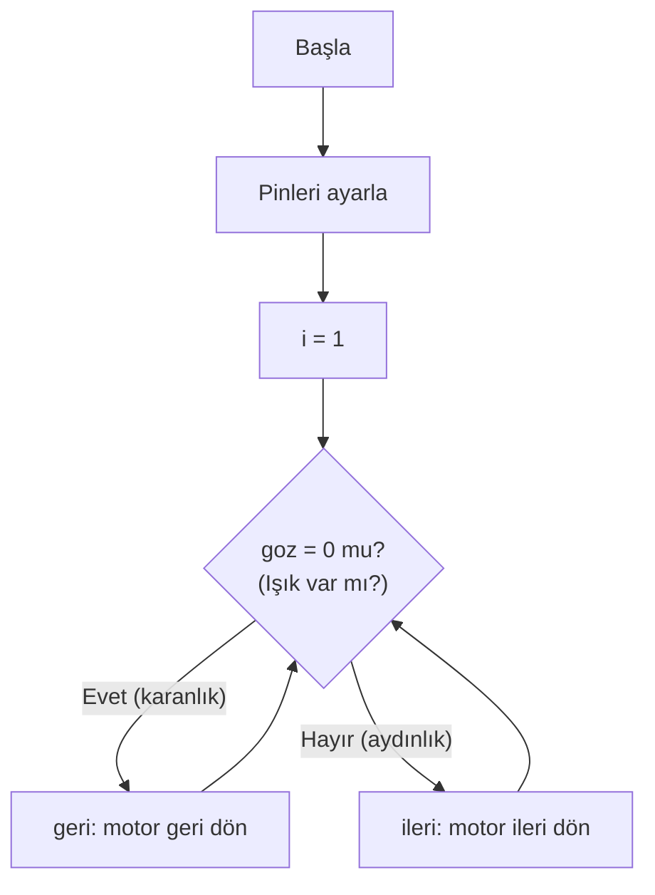

# 📘 Göz Sensörü ile Motor Yön Kontrolü — Konu Anlatımı

> **Kaynak Dosya:** [GOZ.pbp](file:///c:/Users/Aleyna/Desktop/denetleyici/GOZ.pbp)
> **Konu:** Fotoğraf sensör (göz sensörü) ile step motorun yönünü otomatik değiştirme

---

## 📌 1. Bu Kod Ne Yapıyor?

Bir **göz sensörü** (fototransistör/LDR) kullanarak:
- Sensöre **ışık geliyorsa** → motor **ileri** döner
- Sensöre **ışık gelmiyorsa** → motor **geri** döner

Bu, basit bir **otomasyon** örneğidir (örn: bir konveyör bant veya güneş takip sistemi).

---

## 📌 2. Pin Yapılandırması

```basic
TRISB = 0            ' PORTB tamamı çıkış (motor bobinleri)
TRISA = %010000      ' PORTA.4 giriş, diğerleri çıkış
```

### TRISA = %010000 Ne Demek?

```
Bit:    5    4    3    2    1    0
Değer:  0    1    0    0    0    0
Yön:    Ç    G    Ç    Ç    Ç    Ç
```

- **PORTA.4 = Giriş** (sensörden veri okumak için)
- Diğer pinler = Çıkış (motor sürme, sinyal gönderme)

> [!TIP]
> Sadece belirli pinleri giriş yapmak istediğinizde binary gösterimle TRIS ayarını yaparsınız. Bu sınavda çıkabilecek bir soru tipidir.

---

## 📌 3. SYMBOL ile Sensör Tanımı

```basic
symbol goz = portA.4    ' Göz sensörü PORTA.4 pinine bağlı
```

- `goz` artık `portA.4`'ün takma adıdır
- `goz = 0` → ışık **gelmiyor** (karanlık)
- `goz = 1` → ışık **geliyor** (aydınlık)

---

## 📌 4. IF-THEN-ELSE Yapısı

```basic
label:
    if goz = 0 then
        gosub geri       ' Işık yoksa geri dön
    else
        gosub ileri       ' Işık varsa ileri git
    endif
goto label
```

PBP'de **koşullu dallanma** yapısı:

```
IF koşul THEN
    ' koşul doğruysa çalışan kodlar
ELSE
    ' koşul yanlışsa çalışan kodlar
ENDIF
```

> [!IMPORTANT]
> **ENDIF** yazmayı unutmayın! Her `IF-THEN` bloğu **ENDIF** ile kapatılmalıdır. Aksi takdirde derleme hatası alırsınız.

### Tek satırda IF kullanımı:

```basic
if goz = 0 then gosub geri    ' ENDIF gerekmez (tek satır)
```

> [!NOTE]
> Tek satırda `IF` kullanırken `ENDIF` yazmaya gerek yoktur. Ama çok satırlı blok kullanırken **zorunludur**.

---

## 📌 5. İleri ve Geri Alt Programları

```basic
ileri:
    pulsout portA.2, 100     ' Motor sürücüye adım sinyali
    i = i << 1               ' Sola kaydır (ileri yön)
    if i = 16 then i = 1     ' Taşma kontrolü
    portB = i : pause 100    ' Motoru sür, 100ms bekle
return

geri:
    pulsout portA.2, 100
    i = i >> 1               ' Sağa kaydır (geri yön)
    if i = 0 then i = 8      ' Alt sınır kontrolü
    portB = i : pause 100
return
```

Bu yapı tek fazlı step motor sürme kalıbıdır (önceki konudan tanıdık).

---

## 📌 6. Programın Akış Diyagramı



---

## 📌 7. Sınav İçin Dikkat Noktaları

| Konu | Hatırla |
|:---|:---|
| **SYMBOL** | Port pinine isim verir |
| **TRIS binary** | `%010000` → sadece 4. bit giriş |
| **IF-THEN-ELSE-ENDIF** | Çok satırlı koşul yapısı |
| **Tek satır IF** | ENDIF gerektirmez |
| **goz=0** | Sensöre ışık gelmiyor |
| **goz=1** | Sensöre ışık geliyor |
| **Sensör her zaman GİRİŞ** | TRIS'te o bit mutlaka 1 olmalı |
