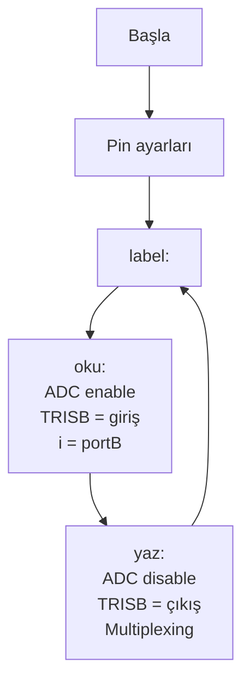

# 📘 Sıcaklık Ölçme (ADC ile) — Konu Anlatımı

> **Kaynak Dosya:** [Sicaklik.pbp](file:///c:/Users/Aleyna/Desktop/denetleyici/Sicaklik.pbp)
> **Konu:** ADC entegresi ile sıcaklık okuma, TRIS dinamik değiştirme, 7-segment display

---

## 📌 1. Bu Kod Ne Yapıyor?

1. **ADC entegresinden** (harici analog-dijital dönüştürücü) sıcaklık değerini okur
2. Değeri birler ve onlar basamağına ayırır
3. **7-segment display** üzerinde gösterir (multiplexing ile)

---

## 📌 2. ADC (Analog-Dijital Dönüştürücü) Nedir?

ADC, analog sinyalleri (sıcaklık sensöründen gelen voltaj gibi) **dijital sayıya** çevirir.

```
Sıcaklık Sensörü → Analog Voltaj → ADC Entegresi → Dijital Değer → PIC
      (LM35)         (0-5V)          (ADC0804)       (0-255)
```

> [!IMPORTANT]
> Bu kodda PIC'in **kendi ADC'si** kullanılmıyor. Harici bir **ADC entegresi** (ADC0804 gibi) kullanılıyor. Bu entegre PORTB üzerinden dijital değer gönderiyor.

---

## 📌 3. Dinamik TRIS Değiştirme ⭐

Bu kodun **en önemli konsepti**: PORTB hem **giriş** (ADC'den okuma) hem **çıkış** (display'e yazma) olarak kullanılıyor!

### Okuma Modu (ADC'den veri al)
```basic
oku:
    portA.0 = 0          ' ADC enable (aktif et)
    TRISB = %11111111    ' PORTB = tamamı GİRİŞ
    i = portB            ' PORTB'den değeri oku
return
```

### Yazma Modu (Display'e yazdır)
```basic
yaz:
    portA.0 = 1          ' ADC disable (devre dışı)
    TRISB = 0            ' PORTB = tamamı ÇIKIŞ
    ' ... segment verilerini PORTB'ye yaz
return
```

> [!CAUTION]
> **TRIS registerı program çalışırken değiştirilebilir!** Bu çok önemli bir kavramdır. TRIS sadece başlangıçta ayarlanmak zorunda değildir. Aynı portu hem giriş hem çıkış olarak kullanmak için TRIS'i sürekli değiştirirsiniz.

### ADC Enable/Disable Mantığı

```
portA.0 = 0  →  ADC enable  →  ADC veri gönderiyor  →  PORTB = giriş
portA.0 = 1  →  ADC disable →  ADC durdu            →  PORTB = çıkış
```

> [!IMPORTANT]
> ADC etkinken PORTB'yi çıkış yapamazsınız (çakışma olur). Önce ADC'yi kapatmalı, sonra TRIS'i çıkış yapmalısınız.

---

## 📌 4. 7-Segment Yazma (Multiplexing)

```basic
yaz:
    portA.0 = 1         ' ADC disable
    TRISB = 0           ' PORTB çıkış
    birler = i dig 0    ' Birler basamağı
    onlar = i dig 1     ' Onlar basamağı
    for j = 0 to 50
        portA.1 = 1             ' Birler display aktif
        portB = a[birler]       ' Birler segment kodu
        pause 10
        portA.1 = 0             ' Onlar display aktif
        portB = a[onlar]        ' Onlar segment kodu
        pause 10
    next j
return
```

Bu multiplexing tekniği Display_Sayi_Yazdirma konusunda öğrenilmişti.

---

## 📌 5. Programın Akış Diyagramı



---

## 📌 6. Sınav İçin Dikkat Noktaları

| Konu | Hatırla |
|:---|:---|
| **Harici ADC** | PORTB üzerinden dijital değer gönderir |
| **portA.0** | ADC enable/disable kontrolü |
| **Dinamik TRIS** | Aynı portu hem giriş hem çıkış yapma |
| **TRISB=%11111111** | Okuma modu (giriş) |
| **TRISB=0** | Yazma modu (çıkış) |
| **Önce ADC kapat** | Sonra TRIS'i çıkış yap |
| **DIG operatörü** | Basamak ayırma |
| **Multiplexing** | İki display'i hızlı değiştirme |
