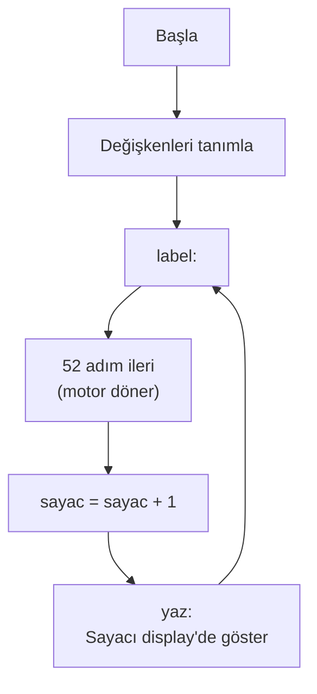

# 📘 Tur Sayısı Gösteren Step Motor — Konu Anlatımı

> **Kaynak Dosya:** [TUR_SAYISI.pbp](file:///c:/Users/Aleyna/Desktop/denetleyici/TUR_SAYISI.pbp)
> **Konu:** Motor tur sayma + 7-segment display entegrasyonu

---

## 📌 1. Bu Kod Ne Yapıyor?

1. Step motoru **tam adım** modunda döndürür (52 adım = yaklaşık 1 tur)
2. Her tur tamamlandığında **sayaç** bir artar
3. Sayaç değerini **7-segment display'de** gösterir

Bu, önceki konuların (motor + display) **bir arada kullanıldığı** bileşik bir projedir.

---

## 📌 2. Motor + Sayaç Mantığı

```basic
label:
    i = l                    ' Motor pozisyonunu geri yükle
    for k = 0 to 51          ' 52 adım (≈1 tur)
        gosub ileri
    next k
    l = i                    ' Motor pozisyonunu kaydet
    sayac = sayac + 1        ' Tur sayacını artır
    gosub yaz                ' Display'e yazdır
goto label
```

### Neden `l` değişkeni kullanılıyor?

`yaz` alt programı PORTB'yi kullanır (display için). Motor da PORTB'yi kullanır. Bu yüzden:
1. Motor pozisyonu `l`'ye kaydedilir
2. Display yazılır (PORTB display verisi olur)
3. Tekrar motor sürmeden önce `l`'den pozisyon geri yüklenir

> [!IMPORTANT]
> **Kaynak paylaşımı**: Motor ve display aynı PORTB'yi kullandığında, pozisyon bilgisini ayrı bir değişkende **kaydetmek** gerekir.

---

## 📌 3. Motor İleri Alt Programı

```basic
ileri:
    pulsout portA.2, 100
    i = i + 1
    if i = 4 then i = 0      ' Döngüsel: 0→1→2→3→0
    portB = motor[i] : pause 100
return
```

Motor dizisi: `motor[0]=3, motor[1]=6, motor[2]=12, motor[3]=9`

Bu tam adım yöntemidir (3-6-12-9).

---

## 📌 4. Display Yazma + Port Paylaşımı

```basic
yaz:
    birler = sayac dig 0
    onlar = sayac dig 1
    for j = 0 to 24
        portA.0 = 0 : portA.1 = 1    ' Birler display aktif
        portB = a[birler]
        pause 10

        portA.0 = 1 : portA.1 = 0    ' Onlar display aktif
        portB = a[onlar]
        pause 10
    next j
    portA = 0
    portB = 0        ' Temizle (motor için hazırla)
return
```

### Display Kontrol Pinleri

| portA.0 | portA.1 | Aktif Display |
|:---:|:---:|:---|
| 0 | 1 | Birler |
| 1 | 0 | Onlar |
| 0 | 0 | Hiçbiri (kapalı) |

> [!NOTE]
> Yazma sonunda `portA=0` ve `portB=0` yapılır. Bu, display'i kapatıp motor sürme için portu hazırlar.

---

## 📌 5. Programın Akış Diyagramı



---

## 📌 6. Sınav İçin Dikkat Noktaları

| Konu | Hatırla |
|:---|:---|
| **Port paylaşımı** | Motor ve display aynı PORTB'yi kullanıyor |
| **Pozisyon kaydetme** | `l = i` ile motor pozisyonunu yedekle |
| **Sayaç** | Her tur sonunda `sayac + 1` |
| **DIG + Multiplexing** | Display yazma yöntemi |
| **portA pinleri** | Display seçimi (portA.0, portA.1) |
| **Motor + Display** | İki farklı donanımı aynı port üzerinden kontrol etme |
