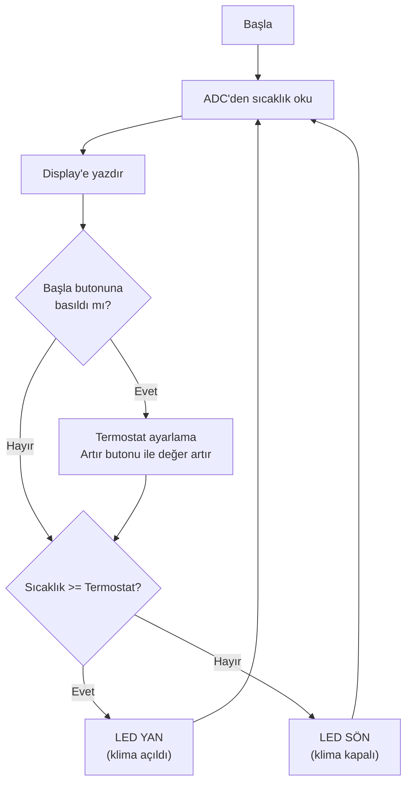

# 📘 Termostat Projesi (7-Segment) — Konu Anlatımı

> **Kaynak Dosya:** [Termostat.pbp](file:///c:/Users/Aleyna/Desktop/denetleyici/Termostat.pbp)
> **Konu:** ADC ile sıcaklık okuma, butonla termostat ayarı, WHILE-WEND, LED kontrolü

---

## 📌 1. Bu Kod Ne Yapıyor?

1. **ADC** ile oda sıcaklığını okur
2. **7-segment display'de** gösterir
3. Bir butona basıldığında **termostat değeri ayarlama** moduna geçer
4. Oda sıcaklığı termostat değerini **geçerse** → LED yanar (klima açıldı)
5. **Altındaysa** → LED söner (klima kapalı)

---

## 📌 2. Buton ve LED Tanımları

```basic
TRISA = %001100           ' A.2 ve A.3 giriş (butonlar), diğerleri çıkış

symbol led    = portA.4   ' LED kontrolü
symbol basla  = portA.2   ' "Ayarla" butonu
symbol artir  = portA.3   ' "Artır" butonu
```

### TRISA = %001100 Analizi

```
Bit:    5    4    3    2    1    0
Değer:  0    0    1    1    0    0
Yön:    Ç    Ç    G    G    Ç    Ç
```

- **portA.2** (basla butonu) = GİRİŞ
- **portA.3** (artır butonu) = GİRİŞ
- **portA.4** (LED) = ÇIKIŞ
- **portA.0** (ADC enable) = ÇIKIŞ

> [!TIP]
> Butonlar **giriş**, LED'ler **çıkış** olmalı. TRIS'te doğru bitlerin 1 (giriş) yapıldığından emin olun!

---

## 📌 3. WHILE-WEND Döngüsü ⭐

```basic
while basla = 0          ' Butona basılı olduğu sürece
    gosub termostat       ' Termostat ayarlama modunda kal
wend                      ' Buton bırakılınca çık
```

| Yapı | Açıklama |
|:---|:---|
| `WHILE koşul` | Koşul doğru olduğu sürece döngüyü çalıştır |
| `WEND` | Döngü sonu (WHILE'a geri dön) |

**Buton mantığı:**
- Butona **basılınca** = `0` (LOW, aktif düşük)
- Buton **bırakılınca** = `1` (HIGH)

> [!IMPORTANT]
> PIC'te butonlar genellikle **aktif düşük** (active low) çalışır: Basıldığında 0, bırakıldığında 1 olur. Sınavda "basla=0 ne demek?" sorulabilir → **butona basılı demektir!**

---

## 📌 4. Termostat Ayarlama Modu

```basic
termostat:
    i = termostatDeger       ' Ekranda termostat değerini göster
    gosub yaz
    while artir = 0          ' Artır butonuna basılı olduğu sürece
        termostatDeger = termostatDeger + 1
        i = termostatDeger
        gosub yaz
        pause 500             ' Yarım saniye bekle (hızlı artmayı önle)
    wend
return
```

Akış:
1. "Başla" butonuna basılınca termostat moduna gir
2. "Artır" butonuna her basışta değer +1 artar
3. Yarım saniye bekleme ile kontrollü artış sağlanır
4. "Başla" butonu bırakılınca normal moda dön

---

## 📌 5. Koşullu LED Kontrolü

```basic
if i >= termostatDeger then
    led = 0     ' LED YAN (oda sıcak → klima açıldı)
else
    led = 1     ' LED SÖN (oda soğuk → klima kapalı)
endif
```

> [!WARNING]
> LED mantığı **ters** olabilir!
> - `led = 0` → LED **yanar** (aktif düşük LED)
> - `led = 1` → LED **söner**
> Bu genellikle LED'in nasıl bağlandığına bağlıdır (ortak anot/katot).

---

## 📌 6. Programın Akış Diyagramı



---

## 📌 7. Sınav İçin Dikkat Noktaları

| Konu | Hatırla |
|:---|:---|
| **WHILE-WEND** | Koşul doğruyken döngü devam eder |
| **Aktif düşük buton** | basla=0 → butona basılı |
| **LED mantığı** | led=0 → yanar, led=1 → söner (aktif düşük) |
| **TRISA binary** | Buton pinleri giriş (1), LED/ADC çıkış (0) |
| **Termostat karşılaştırma** | `>=` ile sıcaklık kontrolü |
| **PAUSE 500** | Buton debounce / hız kontrolü |
| **İç içe WHILE** | Dıştaki: basla butonu, içteki: artır butonu |
